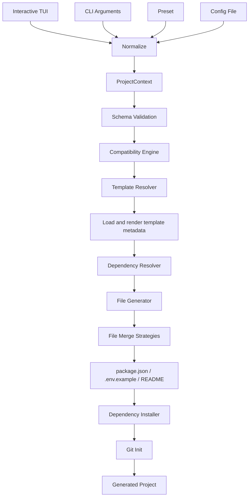

# create-node-app 架构设计

本文面向项目维护者，描述 `create-node-app` 当前已经实现的系统架构、模块职责、
数据流、模板协议和扩展方式。

用户安装和使用说明请查看 [README.md](./README.md)。

## 1. 设计目标

`create-node-app` 是一个组合式 Node.js 后端项目生成器。它将用户选择规范化为统一
上下文，再按维度加载独立模板模块，最终生成可安装、可运行、可继续开发的项目。

核心目标：

- 支持交互式 TUI、CLI 参数、Preset 和配置文件。
- 通过独立模板组合技术栈，避免维护大量预组合模板。
- 在生成前完成输入校验和技术兼容性检查。
- 统一处理依赖、脚本、环境变量和同名文件。
- 保证 Runtime、Language、Framework 与输出配置一致。

当前非目标：

- 不生成测试框架、测试脚本或测试文件。
- 不支持 SQLite。
- 不负责升级或迁移已有项目。
- 不允许 Template Module 直接依赖另一个 Template Module。

## 2. 核心原则

### 2.1 组合，而不是预组合

错误的组织方式：

```text
templates/
├── express-mysql-prisma/
├── express-postgresql-drizzle/
└── hono-mysql-prisma/
```

正确的组织方式：

```text
Base
+ Runtime
+ Framework
+ Database
+ ORM
+ Cache
+ Tooling
+ Architecture
= Generated Project
```

每个维度只维护自己的文件和依赖，组合合法性由 Resolver 和 Compatibility Engine
统一处理。

### 2.2 所有输入汇总到 ProjectContext

Generator 不关心配置来自 TUI、CLI、Preset 还是配置文件。所有入口必须先规范化为
`ProjectContext`。

### 2.3 Framework 与 Architecture 正交

Framework 描述应用使用什么 Web 技术，Architecture 描述业务代码如何分层。

例如：

```text
Express + Minimal
Express + API
Express + Layered
Hono + API
Fastify + Layered
```

这些组合共用对应的 Framework 模板和 Architecture 模板，不需要重复目录。

## 3. 系统总览



主流程位于 `src/generator/generator.ts`。CLI 层只负责收集输入，Generator 之后的
模块都只消费标准化上下文。

## 4. 核心数据模型

`ProjectContext` 是整个系统唯一的完整配置模型：

```typescript
export interface ProjectContext {
  projectName: string
  projectPath: string

  runtime: 'node' | 'bun'
  runtimeVersion: '24' | '22' | '1.4' | '1.3'
  language: 'typescript' | 'javascript'
  framework: 'express' | 'elysia' | 'hono' | 'fastify' | 'none'
  database: 'mysql' | 'postgresql' | 'mongodb' | 'none'
  orm: 'prisma' | 'drizzle' | 'none'
  cache: 'redis' | 'none'
  architecture: 'minimal' | 'api' | 'layered'

  eslint: boolean
  prettier: boolean
  docker: boolean

  packageManager: 'npm' | 'pnpm' | 'yarn' | 'bun'
  noInstall: boolean
  noGit: boolean
}
```

字段分为三组：

| 分组     | 字段                                   | 作用                     |
| -------- | -------------------------------------- | ------------------------ |
| 项目基础 | `projectName`、`projectPath`           | 决定包名和输出目录       |
| 技术选择 | Runtime 到 Architecture                | 决定模板、依赖和生成内容 |
| 执行行为 | Package manager、Tooling、Install、Git | 决定工程配置和生成后操作 |

所有合法选项集中定义在 `src/config/options.ts`。CLI、Prompt 和 Schema Validation
必须复用这些常量，避免多处维护选项列表。

## 5. 输入与规范化

### 5.1 输入来源

系统支持四种配置来源：

| 来源          | 入口                          | 用途                 |
| ------------- | ----------------------------- | -------------------- |
| Interactive   | `src/cli/prompts.ts`          | 逐步选择缺失配置     |
| CLI Arguments | `src/cli/index.ts`            | 自动化和 CI 场景     |
| Preset        | `src/presets/index.ts`        | 使用预定义组合       |
| Config File   | `node-app.config.ts` 或 `.js` | 保存可复用的项目配置 |

### 5.2 配置优先级

非交互模式按以下优先级合并：

```text
CLI Arguments > Config File > Preset > DEFAULT_CONTEXT
```

`undefined` 字段不会覆盖已有值。用户显式切换 Runtime 但没有指定版本时，系统会选择
该 Runtime 的推荐版本：

```text
Node.js -> 24
Bun     -> 1.4
```

### 5.3 交互模式判定

满足以下任一条件时直接进入非交互模式：

- 使用 `--yes`。
- 使用 `--preset`。
- 使用 `--config`。
- CLI 已提供完整技术选项。

否则，Prompt 只询问缺失字段。未选择 Database 时跳过 ORM。

## 6. 模块边界

```text
src/
├── cli/          输入解析、TUI 和命令
├── config/       选项常量与类型
├── context/      ProjectContext、默认值和规范化
├── validation/   Schema 与兼容性规则
├── resolver/     Template、Dependency 和 Preset 解析
├── generator/    文件、package.json、env 和 README 生成
├── merger/       JSON 与 ENV 合并策略
├── runtime/      依赖安装、Git 和包管理器检测
├── presets/      预设配置
└── utils/        日志与路径工具
```

职责边界：

| 模块       | 负责                   | 不负责           |
| ---------- | ---------------------- | ---------------- |
| CLI        | 收集输入、展示状态     | 决定模板内容     |
| Context    | 统一数据模型和默认值   | 兼容性判断       |
| Validation | 字段合法性、组合兼容性 | 文件生成         |
| Resolver   | 选择模板、合并元数据   | 写入目标目录     |
| Generator  | 编排完整生成流程       | 识别输入来源     |
| Merger     | 按文件类型合并内容     | 决定加载哪些模板 |
| Runtime    | 安装依赖、初始化 Git   | 修改生成配置     |

概念上的依赖方向：

```text
cli -> context -> validation -> resolver -> generator -> merger -> runtime
          ^                         ^
          |                         |
      config/presets             templates
```

`config`、`presets` 和 `templates` 是配置或数据来源，不应反向依赖生成流程。

## 7. Template Module

### 7.1 模板分类

```text
templates/
├── base/           common | typescript | javascript
├── runtimes/       node | bun
├── frameworks/     express | elysia | hono | fastify
├── databases/      mysql | postgresql | mongodb
├── orm/            prisma | drizzle
├── cache/          redis
├── tooling/        eslint | prettier | docker
└── architecture/   minimal | api | layered
```

每个目录是一个原子模块。模板之间不能通过路径或代码直接引用彼此。

### 7.2 标准结构

```text
template-module/
├── template.json
└── files/
    └── ...
```

`template.json` 可以声明：

```typescript
interface TemplateMeta {
  name: string
  type: 'base' | 'runtime' | 'framework' | 'database' | 'orm' | 'cache' | 'tooling' | 'architecture'
  version?: string
  description?: string
  dependencies?: Record<string, string>
  devDependencies?: Record<string, string>
  scripts?: Record<string, string>
  env?: Record<string, string>
  compatibility?: {
    runtime?: string[]
    language?: string[]
    framework?: string[]
    database?: string[]
    orm?: string[]
  }
}
```

当前组合合法性由中央 Compatibility Engine 判断。元数据中的 `compatibility` 用于描述
模块自身支持范围，不应在模板内部编写跨模板判断。

### 7.3 模板解析顺序

`resolveTemplates()` 按固定顺序返回模块：

```text
1. base/common
2. base/{language}
3. runtimes/{runtime}
4. frameworks/{framework}
5. databases/{database}
6. orm/{orm}
7. cache/{cache}
8. tooling/eslint
9. tooling/prettier
10. tooling/docker
11. architecture/{architecture}
```

值为 `none` 或关闭的模块会被跳过。

这个顺序同时决定：

- 元数据中同名依赖、脚本和环境变量的覆盖顺序。
- 普通同路径文件的覆盖顺序。
- JSON 和 ENV 文件的合并顺序。

后加载模块具有更高优先级。例如 ORM 可以覆盖 Database 提供的通用
`src/db/client.ts`。

## 8. 模板渲染

### 8.1 变量替换

模板使用 `{{variable}}` 占位符：

```json
{
  "devDependencies": {
    "{{runtimeTypesPackage}}": "{{runtimeTypesRange}}"
  }
}
```

常用变量包括：

| 变量                  | 示例               | 用途                    |
| --------------------- | ------------------ | ----------------------- |
| `projectName`         | `my-server`        | 项目名称                |
| `runtime`             | `node`             | Runtime 条件            |
| `runtimeVersion`      | `24`               | engines、版本文件和镜像 |
| `runtimeTypesPackage` | `@types/node`      | Runtime 类型包          |
| `runtimeTypesName`    | `node`             | `tsconfig.json#types`   |
| `runtimeEntry`        | `dist/index.js`    | Docker 启动入口         |
| `dockerVariant`       | `node-typescript`  | Docker 条件分支         |
| `extension`           | `ts`               | 入口文件扩展名          |
| `database`            | `postgresql`       | Database 条件和动态配置 |
| `toolingDisplay`      | `ESLint, Prettier` | 欢迎页展示工程化配置    |

Prisma 和 Drizzle 还会根据 Database 生成 provider、dialect、schema 和客户端代码。

### 8.2 条件块

普通模板条件：

```text
{{#if runtime=node}}
仅 Node.js 项目保留
{{/if}}
```

需要保持源文件语法合法时，可以使用注释条件：

```typescript
// {{#if language=typescript}}
import tseslint from 'typescript-eslint'
// {{/if}}
```

### 8.3 模板文件名

以 `.template` 结尾的文件在输出时会移除后缀：

```text
eslint.config.js.template -> eslint.config.js
```

需要避免 IDE 按目标文件类型提前检查时，可以增加前导下划线：

```text
_Dockerfile.template -> Dockerfile
```

### 8.4 TypeScript 相对导入

TypeScript 项目的相对导入使用 `.ts` 后缀，使 Node.js 22/24 和 Bun 能直接执行源码：

```typescript
import { app } from './app.ts'
```

`tsconfig.json` 启用 `rewriteRelativeImportExtensions`。执行 `tsc` 后，构建产物中的
相对导入会自动改写为 `.js`，因此 `node dist/index.js` 仍使用标准 ESM 路径。

### 8.5 JavaScript 输出

模板源码主要以 TypeScript 编写。JavaScript 模式下：

- `.ts`、`.mts`、`.cts` 分别映射为 `.js`、`.mjs`、`.cjs`。
- `{{extension}}` 会渲染为 `js`，确保相对导入指向生成后的 JavaScript 文件。
- 使用 esbuild 移除类型语法并输出 ESM。
- 跳过 `tsconfig.json`。
- 从依赖中移除 TypeScript 工具链和 `@types/*`。

该过程只做语法转换，不执行类型检查。

## 9. Validation 与 Compatibility

### 9.1 Schema Validation

Schema Validation 负责保证单个字段有效：

- 项目名符合 npm 包命名约束。
- 项目路径非空。
- 每个枚举值属于支持列表。
- Runtime 与 Runtime version 对应。

示例：

```text
node + 24  -> valid
node + 1.4 -> invalid
bun + 1.4  -> valid
bun + 24   -> invalid
```

### 9.2 Compatibility Engine

Compatibility Engine 负责跨字段规则，规则分为：

- `error`：终止生成。
- `warning`：提示用户后继续。

当前规则：

| 规则                    | 级别    | 条件                       |
| ----------------------- | ------- | -------------------------- |
| `orm-requires-database` | error   | 使用 ORM 但未选择 Database |
| `drizzle-mongodb`       | error   | Drizzle 与 MongoDB 组合    |
| `elysia-runtime`        | warning | Elysia 运行在 Node.js      |
| `express-bun`           | warning | Express 运行在 Bun         |
| `fastify-bun`           | warning | Fastify 运行在 Bun         |

新增规则应追加到 `compatibilityRules`，不要将判断散落到 Template 或 Generator。

## 10. Dependency Resolver

每个 Template Module 只声明自己的依赖、脚本和环境变量：

```json
{
  "dependencies": {
    "drizzle-orm": "^0.38.0"
  },
  "devDependencies": {
    "drizzle-kit": "^0.30.0"
  },
  "scripts": {
    "db:generate": "drizzle-kit generate"
  }
}
```

Dependency Resolver 按模板加载顺序合并：

```text
TemplateMeta[]
      |
      v
dependencies
devDependencies
scripts
env
```

JavaScript 项目会在生成 `package.json` 前过滤 TypeScript 专属依赖；Bun TypeScript
项目会移除不再使用的 `tsx`。

最终 `package.json` 由 Generator 统一生成，不直接复制模板中的 `package.json`。

## 11. File Merge

同一路径可能由多个模板提供，因此文件写入分为两类：

| 文件                   | 策略                                |
| ---------------------- | ----------------------------------- |
| `package.json`         | 由 Dependency Resolver 结果统一生成 |
| 其他 `.json`           | JSON Deep Merge                     |
| `.env`、`.env.example` | Environment Merge                   |
| 普通文件               | 后加载模板覆盖前一个文件            |
| `README.md`            | 根据 ProjectContext 动态生成        |

JSON Deep Merge 规则：

- 对象递归合并。
- 数组和标量由后加载值覆盖。

Environment Merge 规则：

- 按变量名去重。
- 保留已有变量。
- 追加尚未出现的变量。

新增 YAML 等结构化文件时，应实现新的 `MergeStrategy`，而不是在 File Generator
中加入专用分支。

## 12. Generator Pipeline

`createProject()` 的执行顺序：

```text
1. validateContext
2. validateCompatibility
3. 输出 warning
4. 检查并创建目标目录
5. resolveTemplates
6. buildTemplateVariables
7. loadTemplateMeta
8. resolveDependencies
9. copyTemplateFiles
10. generatePackageJson
11. generateEnv
12. generateReadme
13. installDependencies
14. initGit
15. printNextSteps
```

生成失败时会保留原始错误并通过统一 Logger 输出。目标目录已经存在时，Generator
会在写入前终止，避免覆盖用户项目。

## 13. Architecture 模板

Architecture 只提供业务代码组织方式，应用入口和框架路由由 Base 与 Framework
模板负责。

### 13.1 Minimal

```text
route -> inline health handler
```

生成：

```text
src/middleware/logger.ts
```

健康检查逻辑直接渲染到 Framework 路由中。适合 Demo、小工具和简单服务。

### 13.2 API

```text
route -> service -> schema
```

生成：

```text
src/services/health.ts
src/schemas/health.ts
src/middleware/logger.ts
src/routes/.gitkeep
```

适合大多数后端 API。

### 13.3 Layered

```text
route -> controller -> service -> repository
                           |
                           v
                         schema
```

生成：

```text
src/controllers/health.controller.ts
src/services/health.service.ts
src/repositories/health.repository.ts
src/schemas/health.ts
src/middleware/logger.ts
```

适合复杂业务和需要明确职责边界的长期维护项目。

## 14. Runtime 版本一致性

Runtime 与版本必须作为一个整体处理。

| Runtime | 可选版本            | 默认版本 |
| ------- | ------------------- | -------- |
| Node.js | 24、22 LTS          | 24       |
| Bun     | 1.4、1.3 稳定版本线 | 1.4      |

版本会同步写入：

```text
ProjectContext.runtimeVersion
├── package.json#engines
├── .nvmrc / .bun-version
├── @types/node / @types/bun
├── tsconfig.json#compilerOptions.types
├── Docker base image
└── Generated README
```

Node.js 24 的 engines 示例：

```json
{
  "engines": {
    "node": ">=24.0.0 <25.0.0"
  }
}
```

Bun 1.4 的 engines 示例：

```json
{
  "engines": {
    "bun": ">=1.4.0 <1.5.0"
  }
}
```

Bun 没有正式 LTS 制度，代码、TUI 和文档中都应使用 `stable` 描述 Bun 版本。

## 15. 输出职责

| 输出                      | 主要负责模块      |
| ------------------------- | ----------------- |
| `web/index.html`          | Base Common       |
| `src/middleware/logger.*` | Base Common       |
| `src/index.*`             | Base 或 Framework |
| `src/routes/*`            | Framework         |
| 业务分层目录              | Architecture      |
| `src/db/*`                | Database 或 ORM   |
| `prisma/schema.prisma`    | Prisma            |
| `src/redis/client.*`      | Redis             |
| `eslint.config.js`        | ESLint            |
| `prettier.config.js`      | Prettier          |
| `Dockerfile`              | Docker            |
| `.nvmrc` / `.bun-version` | Runtime           |
| `package.json`            | Package Generator |
| `.env.example`            | Env Generator     |
| `README.md`               | README Generator  |

这个表用于判断新文件应该归属哪个模板。Framework 不应生成 Repository，
Architecture 不应写入 Framework 依赖。

欢迎页请求链路：

```text
web/index.html
    ^
    |
GET /  <- Express / Elysia / Hono / Fastify / built-in HTTP server
```

`base/common` 只负责生成唯一的欢迎页。Framework 入口直接读取该文件并把 `/`
映射到页面，同时提供 RESTful `GET /api/greetings` 示例资源；选择
`framework=none` 时，Base 入口使用 Runtime 内置的 HTTP API 提供 `/`、
`/api/greetings` 和 `/health`。

`src/middleware/logger.*` 按所选 Framework 条件渲染，只包含当前运行时需要的日志
中间件。所有入口都使用各框架原生中间件或生命周期记录请求，日志格式统一为：

```text
HTTP GET     /api/greetings 200 2ms
```

## 16. 扩展方式

### 16.1 新增 Framework

1. 在 `src/config/options.ts` 的 `FRAMEWORKS` 中注册名称。
2. 创建 `templates/frameworks/<name>/template.json`。
3. 添加应用入口，将 `/` 映射到 `homePage`，并提供 `/health` 路由。
4. 在 Compatibility Engine 中添加必要规则。
5. 补充 Resolver、Generator 和 CLI 测试。
6. 更新 README 支持矩阵。

### 16.2 新增 Database

1. 在 `DATABASES` 中注册名称。
2. 创建 `templates/databases/<name>`。
3. 声明驱动依赖和 `DATABASE_URL`。
4. 添加原生客户端模板。
5. 补充 Prisma / Drizzle 动态变量。
6. 添加 ORM 兼容性规则和测试。

### 16.3 新增 ORM

1. 在 `ORMS` 中注册名称。
2. 创建独立 ORM 模板。
3. 在元数据中声明依赖和数据库脚本。
4. 使用模板变量适配 Database，不直接引用 Database 模板。
5. 添加不支持组合的 Compatibility Rule。

### 16.4 新增 Tooling

1. 创建 `templates/tooling/<name>`。
2. 在 `ProjectContext` 中添加开关。
3. 更新 CLI、Prompt、默认值和 Resolver。
4. 对结构化配置使用 MergeStrategy。
5. 添加独立启用和禁用测试。

### 16.5 新增 Architecture

1. 在 `ARCHITECTURES` 中注册名称。
2. 创建 `templates/architecture/<name>`。
3. 只添加业务组织文件，不复制 Framework 入口或路由实现。
4. 为健康路由使用 `healthRouteHandlerSource`，由 Renderer 接入所选 Architecture。

## 17. 测试策略

仓库测试覆盖以下边界：

```text
tests/
├── cli/             非交互命令生成
├── config/          选项顺序和 Runtime 版本
├── context/         默认值与 Normalize
├── validation/      Schema 和 Compatibility
├── resolver/        Template、Dependency 和 Preset
├── merger/          JSON 与 ENV 合并
└── generator/       渲染、语言转换和最终输出
```

变更的最低验证要求：

```bash
pnpm test
pnpm typecheck
pnpm lint
pnpm build
```

涉及模板组合、运行时版本或依赖变化时，还应在系统临时目录中生成真实项目，并执行：

```bash
<package-manager> install
<package-manager> run typecheck
<package-manager> run build
```

## 18. 必须保持的系统约束

1. Template Module 必须保持独立，不能互相引用。
2. Framework 与 Architecture 必须保持正交。
3. 所有输入必须先转换为 `ProjectContext`。
4. Generator 不能判断配置来自哪个输入入口。
5. 结构化文件必须使用对应的 MergeStrategy。
6. 兼容性判断必须集中在 Compatibility Engine。
7. Runtime 版本必须贯穿全部版本相关输出。
8. 生成项目不能包含脚手架仓库自身的测试设施。
9. 数据库范围只包含 MySQL、PostgreSQL、MongoDB 和 None。
10. 新功能必须同步更新测试、README 和本架构文档。
